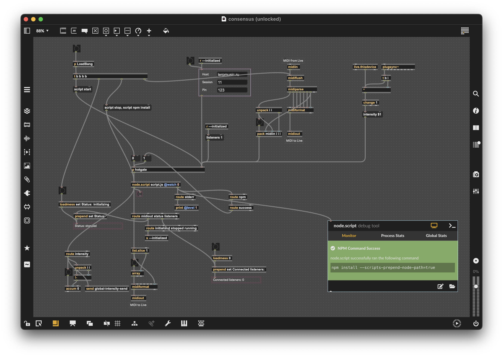

# Сайт [lerpmusic.ru](https://lerpmusic.ru)

Персональная страничка, а также хостинг для интерактивных приложений для работы со звуком.

Приложение написано на Kotlin + Ktor, для сборки используется Gradle.

Технические детали:

- используется структура директорий
  из [Amper](https://github.com/JetBrains/amper/blob/fffc216664588c7a369064c157cbc33f68826ed9/docs/Documentation.md#project-layout),
  она проще, чем стандартный стиль `Gradle`/`Maven`.
- проект хостится на VPS, деплой идёт через `docker compose` и удалённый `docker context`.

## Как запустить

На машине должны быть доступны `docker` и `gradle`.
Для деплоя используется docker-контекст `lerpmusic`.

```shell
docker context use lerpmusic # куда деплоить
gradle jibDockerBuild
export SESSION_PIN=123
docker compose -f app/docker-compose.yml up -d
```

## Consensus

Идея: слушатели могут зайти на сайт и повлиять на лайв-перформанс через "пульт управления" с кнопками `+` и `-`.

В отличие от существующих проектов (например, [multi.operator](https://soloop.me/en/multi.operator/)),
взаимодействие между слушателями/композицией идёт через сайт, а не через локальную сеть.
Это позволяет одновременно проводить несколько независимых перформансов одновременно, подключать к одному перформансу
несколько сессий Ableton Live, расплачиваясь за это дополнительной задержкой в десятки/сотни миллисекунд.

Система состоит из трёх приложений, общающихся через `WebSocket`:

- клиентское приложение — примитивное SPA на HTML/JS
- сервер — написан на Kotlin/Ktor
- девайсы для Ableton Live — написаны на [Max](https://cycling74.com/products/max) с
  использованием [Node For Max](https://docs.cycling74.com/legacy/max8/vignettes/00_N4M_index)
  и [Kotlin/JS](https://kotlinlang.org/docs/js-overview.html).

Технические детали:

- в `consensus-domain` лежит общий код сервера и патчей для Ableton Live — доменная модель, DTO и общие утилиты.
- активно используются [корутины](https://kotlinlang.org/docs/coroutines-overview.html) и [
  `Flow`](https://kotlinlang.org/docs/flow.html)


